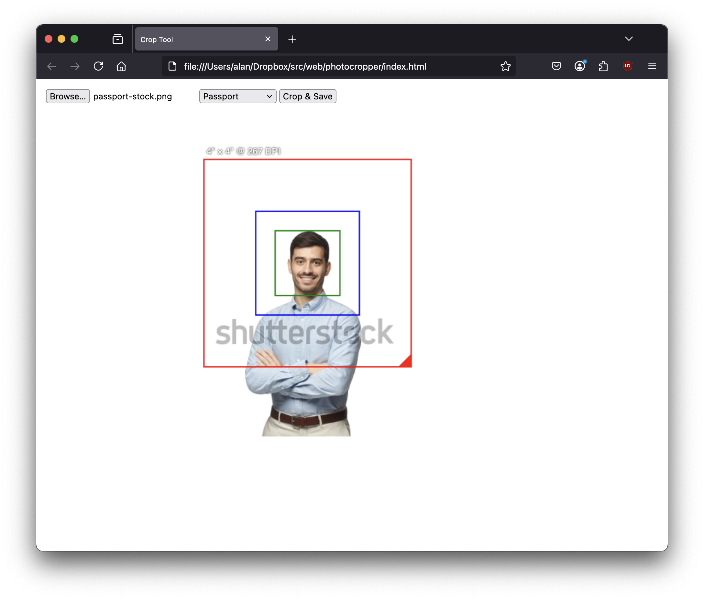

Simple web tool for cropping photos for printing and cutting.

Example: you need a 2"x2" passport photo. You can buy one at walgreens for $16. Or you can print a 4"x4" photo for $0.40. But the latter option only works if you can crop the image correctly before printing, then cut out the 2"x2" square you need. This tool helps with that.

Multiple scenarios are supported. The passport scenario is defined like this:

```
passport: {
    label: "Passport",
    outer: [4.0, 4.0], // printed size (inches)
    inner: [2.0, 2.0], // cut size (inches)
    extra: [1.25, 1.25] // face size (inches)
}
```



